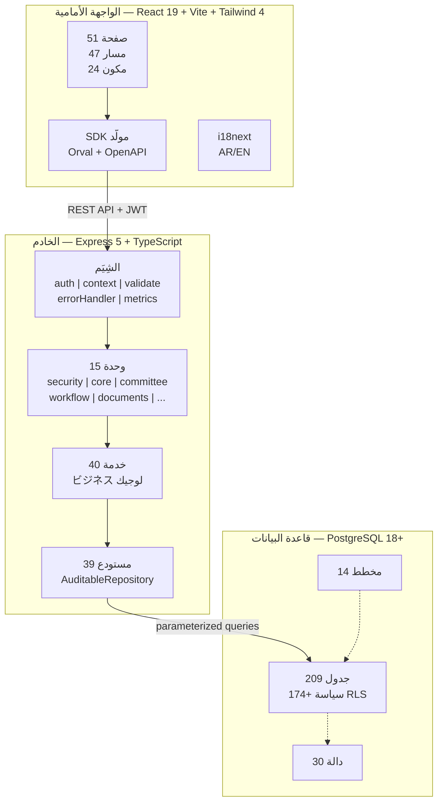
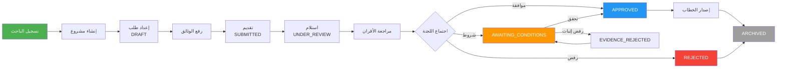
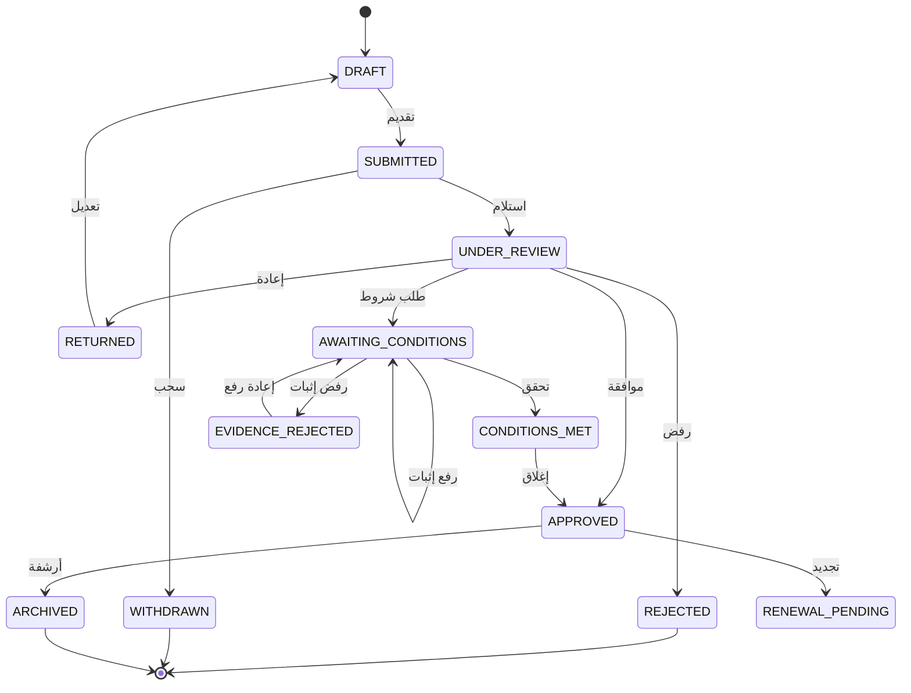

# تقرير شامل — نظام إدارة أخلاقيات واعتمادات البحوث الصحية
# National Research Ethics Management System — Comprehensive Report

---

| الحقل | القيمة |
|-------|--------|
| **اسم النظام** | National Research Ethics Management System — نظام إدارة أخلاقيات واعتمادات البحوث الصحية |
| **الإصدار** | Development / Pre-release (لا يوجد إصدار إنتاجي مُنشر) |
| **تاريخ التقرير** | 2026-09-02 |
| **حالة التقرير** | تحليل وتوثيق فقط — لا تغييرات تنفيذية |
| **النطاق** | كل مكونات النظام: Backend, Frontend, Database, API, Governance, Testing, DevOps |
| **سياسة الأدلة** | كل معلومة موثقة بمصدرها. ما لا يمكن إثباته يُعلن: "غير مثبت في الإصدار الحالي" |

---

## جدول المحتويات

| القسم | العنوان |
|-------|---------|
| 1 | الملخص التنفيذي — Executive Summary |
| 2 | هدف النظام — System Purpose |
| 3 | المستخدمون — Technology Stack |
| 4 | المعمارية — Architecture |
| 5 | رحلة المستخدم الكاملة — Complete User Journey |
| 6 | المزايا — Features |
| 7 | فوائد الباحثين — Benefits to Researchers |
| 8 | فوائد وزارة الصحة — Benefits to Ministry of Health |
| 9 | فوائد اللجان — Benefits to Committees |
| 10 | فوائد الأطراف المعنية الأخرى — Benefits to Other Stakeholders |
| 11 | أمن المعلومات — Security |
| 12 | هندسة البيانات — Data Architecture |
| 13 | محرك دورة العمل — Workflow Engine |
| 14 | إدارة الوثائق — Documents |
| 15 | الإشعارات — Notifications |
| 16 | التقارير — Reporting |
| 17 | إمكانية التدقيق — Auditability |
| 18 | تقليل الجهد التشغيلي — Operational Effort Reduction |
| 19 | مصفوفة القدرات الحالية — Current Capability Matrix |
| 20 | القيود الحالية — Current Limitations |
| 21 | التطور المستقبلي — Future Evolution |
| 22 | الحوكمة — Governance |
| 23 | الإحصائيات — Statistics |
| 24 | مستوى نضج النظام — System Maturity |
| 25 | سيناريو كامل — End-to-End Scenario |
| 26 | مخططات موصى بها — Recommended Diagrams |
| 27 | الخلاصة التنفيذية — Executive Conclusion |

---

## القسم 1 — الملخص التنفيذي

### ما هو النظام؟

نظام رقمي مركزي لإدارة أخلاقيات البحث الصحي واعتمادات المؤسسات البحثية في اليمن. يوفر النظام دورة عمل رقمية كاملة: من تسجيل الباحث وتقديم طلب البحث伦理_review، مروراً بمراجعة اللجنة والتحقق، وصولاً إلى إصدار الموافقة والأرشفة.

### لماذا تم بناؤه؟

لتحويل إدارة البحث الصحي من عملية يدوية ورقية متفرقة إلى عملية رقمية مركزة قابلة للتتبع ومحكومة.

### المشكلة التي يحلها

1. تشتت إدارة الطلبات بين المؤسسات
2. عدم وجود نظام مركزي لتتبع حالة الأبحاث
3. صعوبة تدقيق القرارات الأخلاقية
4. غياب الأرشفة الرقمية الموحدة
5. صعوبة إصدار التقارير والإحصائيات

### من المستفيد منه؟

الباحثون، لجان أخلاقيات البحث، وزارة الصحة، المؤسسات الصحية، الجامعات، مراكز البحوث، الإدارة العليا، مديرو النظام، فرق أمن المعلومات، الجهات الرقابية، الشركاء والجهات الممولة.

### دورة العمل الرئيسية

```
باحث → حساب → مشروع → طلب → مستندات → تحقق أولي → لجنة → مراجعين → مراجعة → قرار → موافقة → تنفيذ → أرشفة → تدقيق
```

### ما الذي يميز النظام؟

- محرك دورة عمل عام مدعوم بقاعدة البيانات
- حماية مستوى الصفوف (RLS) عبر PostgreSQL
- حوكمة معمارية عبر ADRs وسجلات قواعد
- واجهة عربية مع دعم RTL كامل
- بنية Three-Layer (Routes → Services → Repositories)

### مستوى النضج الحالي

**النظام في مرحلة تطوير متقدمة (Advanced Development).** البنية التحتية الكاملة موجودة: 209 جدول، 111 مسار API، 51 صفحة واجهة، 40 خدمة، 39 مصنف. البيانات التجريبية (Yemen dataset) موجودة. لكن النظام **لم يُنشر في بيئة إنتاج حقيقية** — لا يوجد مستخدمون حقيقيون، لا توجد اتصالات حقيقية، لا توجد مراجعة إنتاجية.

### ما تم تنفيذه فعلياً

- بنية Three-Layer كاملة
- محرك دورة عمل عام من قاعدة البيانات
- 14 schema لقاعدة البيانات مع 209 جدول
- واجهة مرفوعة مع 51 صفحة و47 مسار
- نظام أمان متعدد الطبقات (JWT, RBAC, RLS)
- نظام إشعارات (هيكل، لا قنوات فعلية مكتملة)
- نظام وثائق مع دورة حياة ومراحل
- نظام لجان مع دورات واجتماعات ومراجعات
- حوكمة معمارية عبر ADRs
- CI/CD عبر GitHub Actions

### ما يحتاج إلى استكمال

- نشر إنتاجي (Production Deployment)
- مستخدمون حقيقيون
- اتصالات حقيقية (.email, SMS)
- اختبارات تكاملية شاملة
- مراقبة إنتاجية (Monitoring)
- نسخ احتياطي إنتاجي
- تكامل مع أنظمة خارجية فعلية

---

## القسم 2 — هدف النظام

### الهدف من النظام

تحويل إدارة البحث الصحي في اليمن من:

| **قبل النظام** | **بعد النظام** |
|-----------------|----------------|
| طلبات ورقية متفرقة | طلبات رقمية مركزة |
| تتبع يدوي بالبريد/الهاتف | تتبع إلكتروني عبر لوحة التحكم |
| أرشفة ورقية عرضة للضياع | أرشفة رقمية مع تشفير وسلامة |
| قرارات بدون تدقيق واضح | قرارات مع سجل تدقيق كامل |
| صعوبة إصدار التقارير | تقارير وإحصائيات فورية |
| تشتت إدارة اللجان | إدارة لجان رقمية موحدة |

### الأدلة على التحول في النظام

1. **القاعدة المركزة**: 209 جدول في 14 schema — كل البيانات في مكان واحد
2. **دورة العمل الرقمية**: محرك state machine عام مدعوم بقاعدة البيانات (workflow.workflow_definitions, workflow.workflow_transitions)
3. **الأرشفة الرقمية**: دورة حياة وثائق مع lifecycle states, checksums, retention rules, watermarking
4. **التدقيق الكامل**: audit schema مع triggers تلقائية تسجل كل تغيير
5. **واجهة عربية**: i18next مع ملفات ar.json/en.json ودعم RTL عبر Tailwind
6. **الأمان المتعدد الطبقات**: JWT + RBAC + RLS + audit logging

---

## القسم 3 — المستخدمون — Technology Stack

### Frontend

| العنصر | التفاصيل |
|--------|----------|
| **لغة البرمجة** | TypeScript ~6.0 |
| **الإطار** | React 19.2 + Vite 8.0 |
| **تنسيق CSS** | Tailwind CSS 4.3 |
| **المكتبات الرئيسية** | Radix UI (Dialog, Select), Recharts, lucide-react, axios, react-hook-form, zod, sonner, clsx, class-variance-authority |
| **بنية واجهة المستخدم** | 24 مكون مشترك (UI primitives + composite), 51 صفحة |
| **دعم RTL/العربية** | i18next 26.3 + react-i18next + i18next-browser-languagedetector — ملفات ar.json/en.json, class `rtl` في Tailwind |
| **إدارة الحالة** | TanStack React Query 5.101 (server state), React Context (auth state) |
| **تكامل API** | Axios 1.17 مع interceptors (JWT refresh), أو SDK مولّد عبر Orval من OpenAPI |

### Backend

| العنصر | التفاصيل |
|--------|----------|
| **لغة البرمجة** | TypeScript (CommonJS output) |
| **الوقت التشغيلي** | Node.js 22+ |
| **الإطار** | Express 5.2 |
| **المعمارية** | Three-Layer: Routes (15 modules) → Services (40 ملف) → Repositories (39 ملف) |
| **طبقة الخدمات** | 40 ملف خدمة تغطي: workflow, conditions, documents, verification, watermark, accreditation, notifications, forms, committees, auth, etc. |
| **طبقة المصنفات** | 39 ملف مصنف (مع AuditableRepository base) تغطي كل domians |
| **المصادقة** | jose 6.2 (JWT Bearer), refresh token في httpOnly cookie, salt rounds ≥12 |
| **التوثيق** | pino 10.0 + pino-http (structured JSON logging) |
| **معالجة الأخطاء** | Middleware مركزي (errorHandler.ts) مع خطأ موحد JSON |
| **التحقق** | Zod 4.4 schemas مع validate middleware |
| **الأمان** | helmet 8.2, CORS, express-rate-limit 8.5 |

### قاعدة البيانات

| العنصر | التفاصيل |
|--------|----------|
| **نظام إدارة** | PostgreSQL |
| **الإصدار** | 18+ (محدد في AGENTS.md) |
| **عدد الـ Schemas** | 13 + public = 14 إجمالي |
| **عدد الجداول** | 209 (bootstrap DDL) / 184 (ملف القيود الموروث) |
| **الـ Schemas** | audit, committee, communication, core, documents, integration, monitoring, reference, reporting, safety, security, system, workflow |
| **الـ Functions** | 30 function (canonical) |
| **ال Seeds** | 80 ملف SQL |
| **RLS** | مفعّل مع سياسات على كل الجداول |
| **المؤثرات** | system.fn_log_audit() على كل جدول تعديل |
| **القيود** | Foreign keys, NOT NULL, UNIQUE, CHECK constraints عبر 14 ملف canonical |

### API

| العنصر | التفاصيل |
|--------|----------|
| **نمط API** | RESTful JSON |
| **إصدار OpenAPI** | 3.1.0 |
| **عدد المسارات** | 111 مسار |
| **عدد الوحدات** | 15 وحدة backend (security, core, committee, workflow, documents, communication, safety, reporting, admin, integration, monitoring, reference, system, forms, public) |
| **عدد ملفات المسارات** | 27 ملف route |
| **المصادقة** | JWT Bearer Token |
| **التفويض** | RBAC مع 8 صلاحيات على الأقل |
| **التحقق** | Zod schemas لكل endpoint |
| **توثيق API** | OpenAPI 3.1.0 + swagger-ui-express |

### الاختبارات

| العنصر | التفاصيل |
|--------|----------|
| **إطار الاختبار** | Vitest 4.1 (backend + frontend) |
| **اختبارات التكامل** | supertest 7.2 (backend) |
| **اختبارات E2E** | Playwright 1.61 |
| **ملفات اختبار Backend** | 25 ملف اختبار |
| **ملفات اختبار Frontend** | ملفات .test.tsx في frontend/src |
| **CI/CD** | GitHub Actions — 5 مراحل: validate → backend → frontend → e2e → docker |

### DevOps / النشر

| العنصر | الحالة |
|--------|--------|
| **Docker** | docker-compose.yml موجود (postgres:18-alpine + backend + frontend) — ARCHITECTURAL/PLANNED |
| **GitHub Actions** | CI pipeline بـ 5 مراحل — IMPLEMENTED |
| **Scripts** | PowerShell scripts للتطوير والاستعادة — IMPLEMENTED |
| **Production Deployment** | غير مثبت في الإصدار الحالي |
| **Kubernetes** | غير مثبت في الإصدار الحالي |
| **Cloud** | غير مثبت في الإصدار الحالي |

---

## القسم 4 — المعمارية — Architecture

### المعمارية الحالية للنظام (Current Runtime Architecture)

```
┌─────────────────────────────────────────────────────┐
│                    Frontend (React)                   │
│   Pages (51) → Components (24) → API Client (Axios) │
└──────────────────────┬──────────────────────────────┘
                       │ HTTP + JWT Bearer
                       ▼
┌─────────────────────────────────────────────────────┐
│                    API Layer (Express 5)              │
│   Modules (15) → Routes (27 files) → OpenAPI 3.1    │
│   Middleware: auth → rbac → validate → context        │
└──────────────────────┬──────────────────────────────┘
                       │
                       ▼
┌─────────────────────────────────────────────────────┐
│                  Service Layer (40 files)             │
│   workflow | conditions | documents | notifications  │
│   auth | forms | committees | accreditation | ...    │
└──────────────────────┬──────────────────────────────┘
                       │
                       ▼
┌─────────────────────────────────────────────────────┐
│               Repository Layer (39 files)            │
│   AuditableRepository base → domain repositories    │
│   AsyncLocalStorage → SET SESSION app.user_id        │
└──────────────────────┬──────────────────────────────┘
                       │ pg Pool + RLS context
                       ▼
┌─────────────────────────────────────────────────────┐
│              Database (PostgreSQL 18+)                │
│   14 schemas | 209 tables | 30 functions            │
│   RLS policies | Audit triggers | FK constraints    │
└─────────────────────────────────────────────────────┘
```

### فصل المسؤوليات (Separation of Concerns)

| الطبقة | المسؤولية | الملفات |
|--------|-----------|---------|
| **Routes** | استقبال الطلبات، التحقق المبدئي، استدعاء الخدمات | 27 ملف route |
| **Services** | المنطق التجاري، التنسيق، دعم القرار | 40 ملف service |
| **Repositories** | الوصول للبيانات، بناء الاستعلامات، ضمان RLS | 39 ملف repository |
| **Middleware** | المصادقة، التفويض، التحقق، السياق، أخطاء، مقاييس | 6 ملف middleware |

### RBAC — التفويض على أساس الأدوار

- **الأدوار المدعومة**: SUPER_ADMIN, ETHICS_ADMIN, RESEARCHER, COMMITTEE_CHAIR, COMMITTEE_MEMBER, REVIEWER, INSTITUTION_ADMIN, PUBLIC
- **الصلاحيات**: 8 صلاحيات على الأقل (manage_users, manage_roles, manage_institutions, manage_applications, manage_reviews, manage_committees, view_reports, manage_settings)
- **التنفيذ**: middleware/auth.ts (JWT verify) + middleware/rbac.ts (permission check)

### RLS — حماية مستوى الصفوف

- **174+ سياسة RLS** عبر كل الـ schemas
- **التنفيذ**: AsyncLocalStorage في middleware/context.ts → SET SESSION app.user_id → RLS policies يقرأونه
- **الأهمية**: هذا هو آليات التفويض الوحيد على مستوى قاعدة البيانات — لا يُعطّل أبداً

### التدقيق (Audit)

- **المؤثرات**: system.fn_log_audit() على كل جدول تعديل
- **البيانات**: audit.audit_log مع user_id, action, entity_type, entity_id, old_values, new_values, timestamp
- **المصادقة**: RLS على audit tables مع fn_is_admin()

### المعاملات (Transactions)

- **التنفيذ**: عبر pg Pool — كل طلب API يحصل على اتصال وحيد
- **RLS Context**: SET SESSION app.user_id لكل اتصال عبر AsyncLocalStorage

### التحقق (Validation)

- **Frontend**: Zod schemas في frontend/src/lib/schemas.ts مع react-hook-form
- **Backend**: Zod schemas في middleware/validate.ts
- **Database**: CHECK constraints, NOT NULL, UNIQUE

### التسجيل (Logging)

- **المكتبة**: pino 10.0 (JSON structured logging)
- **الطلب**: pino-http مع request/response logging
- **المقاييس**: prom-client 15.1 (Prometheus metrics)
- **معرف الطلب**: UUID v7 عبر middleware/request-id.ts

### المعمارية الدستورية (Constitutional Governance Architecture)

هذه طبقة **فوق** المعمارية التشغيلية — تحدد قواعد اتخاذ القرار والتوثيق:

| العنصر | الوصف | الحالة |
|--------|-------|--------|
| **ADRs** | 36 قرار معماري (ADR-001/002 APPROVED, ADR-018/019 PROPOSED) | IMPLEMENTED |
| **السجلات** | rule.registry.ts, exception.registry.ts, verification.registry.ts | IMPLEMENTED |
| **العلاقات** | traceability-graph.ts, gate-dependency.ts, relationship-kinds.ts | IMPLEMENTED |
| **الاسم** | Constitutional Architecture (Rule 11: Terminal State Derivation) | IMPLEMENTED |
| **التطبيق** |.runtime: غير مثبت — هذه طبقة حوكمة وليست runtime functionality | DOCUMENTED ONLY |

> **ملاحظة مهمة**: طبقة الحوكمة المعمارية (ADRs, Registries, Specifications) هي أدوات توثيق واتخاذ قرار — وليست بالضرورة وظائف runtime نشطة في النظام.

---

## القسم 5 — رحلة المستخدم الكاملة — Complete User Journey

### المرحلة 1: إنشاء حساب الباحث

| العنصر | التفاصيل |
|--------|----------|
| **الإجراء** | التسجيل عبر /register |
| **البيانات** | الاسم، البريد الإلكتروني، كلمة المرور، المؤسسة، رقم الهاتف |
| **الأدوار** | RESEARCHER (الافتراضي) |
| **الصلاحيات** | submit_applications, view_own_applications |
| **التحقق** | verify-email page موجود، نظام verify عبر OTP |
| **تسجيل الدخول** | /login — JWT Bearer token + refresh token في httpOnly cookie |
| **الأدلة** | `frontend/src/pages/RegisterPage.tsx`, `backend/src/modules/security/routes/auth.ts`, `security.fn_register_user()` |
| **الحالة** | IMPLEMENTED |

### المرحلة 2: إنشاء المشروع البحثي

| العنصر | التفاصيل |
|--------|----------|
| **الإجراء** | إنشاء مشروع عبر /projects/create |
| **البيانات** | عنوان المشروع، وصف البحث، المؤسسة الباحثة، الباحث الرئيسي، الباحثون الفرعيون |
| **Database** | core.projects, core.project_members |
| **الأدلة** | `frontend/src/pages/ProjectCreate.tsx`, `backend/src/modules/core/routes/projects.ts` |
| **الحالة** | IMPLEMENTED |

### المرحلة 3: تقديم طلب البحث

| العنصر | التفاصيل |
|--------|----------|
| **الإجراء** | إنشاء طلب عبر /applications/create |
| **البيانات** | نوع البحث، عنوان الطلب، وصف المنهجية، الباحث الرئيسي، المؤسسة، المدة المتوقعة |
| **رفع المستندات** | عبر document upload مع document types |
| **Database** | core.applications, documents.documents |
| **الحالة** | IMPLEMENTED |

### المرحلة 4: التحقق الأولي

| العنصر | التفاصيل |
|--------|----------|
| **الإجراء** | التحقق من اكتمال الطلب وصحته |
| **Mechanism** | Zod validation + completeness checks |
| **Document Validation** | التحقق من رفع المستندات المطلوبة |
| **Workflow State** | DRAFT → SUBMITTED |
| **Database** | workflow.workflow_instances |
| **الحالة** | IMPLEMENTED |

### المرحلة 5: اللجنة

| العنصر | التفاصيل |
|--------|----------|
| **الإجراء** | تعيين الطلب للجنة مناسبة |
| **Database Entities** | committee.committees, committee.committee_cycles, committee.committee_members |
| **الأدلة** | `backend/src/modules/committee/routes/committees.ts`, `committee.meetings`, `committee.review_assignments` |
| **الحالة** | IMPLEMENTED |

### المرحلة 6: المراجعة الأخلاقية

| العنصر | التفاصيل |
|--------|----------|
| **الإجراء** | تعيين المراجعين وإجراء المراجعة |
| **Database** | committee.review_assignments, committee.reviews, committee.review_answers |
| **النتائج** | scores, recommendations, comments |
| **Conflict of Interest** | committee.ethics_risk_assessments (يوجد هيكل، بيانات محدودة) |
| **الحالة** | IMPLEMENTED |

### المرحلة 7: اتخاذ القرار (Decision Making)

| العنصر | التفاصيل |
|--------|----------|
| **الإجراء** | تجميع آراء المراجعين وأعضاء اللجنة وإصدار القرار النهائي |
| **الحالات من قاعدة البيانات** | DRAFT, SUBMITTED, UNDER_REVIEW, APPROVED, REJECTED, RETURNED, WITHDRAWN, ARCHIVED |
| **محرك سير العمل** | الانتقال عبر `workflow.workflow_transitions` مع اشتراط الأدوار والتعليق والتصويت |
| **الأدوار** | COMMITTEE_CHAIR (يقرر) + COMMITTEE_MEMBER (يُصوّت) + REVIEWER (يُراجع) |
| **الانتقالات الحرجة** | COMMITTEE_APPROVE, COMMITTEE_REJECT, COMMITTEE_RETURN |
| **Database** | workflow.workflow_transitions, committee.review_answers |
| **الأدلة** | `backend/src/services/workflow.service.ts`, `workflow.workflow_definitions`, `workflow.workflow_transitions` |
| **الحالة** | IMPLEMENTED |

### المرحلة 8: الموافقة البحثية (Research Approval)

| العنصر | التفاصيل |
|--------|----------|
| **الإجراء** | إصدار شهادة موافقة رسمية بعد القرار بالموافقة |
| **جدول الشهادات** | `documents.certificates` مع serial_number, validity, conditions |
| **إصدار الشهادة** | عبر `certificate.service.ts` مربوطة بالطلب والمشروع |
| **التحقق الرقمي** | رمز QR + رابط تحقق عام عبر الرقم التسلسلي |
| **التوقيع الرقمي** | `document_signatures` — **هيكلي فقط** (لا يوجد مزود توقيع إلكتروني) |
| **Database** | documents.certificates, documents.document_signatures |
| **الأدلة** | `backend/src/services/certificate.service.ts`, `seed/45-certificates.sql` |
| **الحالة** | IMPLEMENTED (هيكل) / PARTIALLY IMPLEMENTED (توقيع) |

### المرحلة 9: تنفيذ البحث (Research Execution)

| العنصر | التفاصيل |
|--------|----------|
| **الإجراء** | متابعة تنفيذ البحث المعتمد عبر المراقبة والسلامة والمستندات |
| **المراقبة** | `monitoring.monitoring_plans`, `monitoring_visits`, `monitoring_findings`, `monitoring.deviations` |
| **السلامة** | `safety.adverse_events`, `safety.risk_incidents`, `safety.corrective_actions` |
| **المستندات** | رفع مستندات جارية عبر `documents.documents` مع checksum |
| **التعديلات** | انتقالات إضافية: RENEWAL_APPROVED, RENEWAL_REJECTED, ACCEPT_APPEAL |
| **⚠️ ملاحظة** | **لا يدير النظام تنفيذ البحث اليومي** — يقتصر على الموافقة والمراقبة والتوثيق فقط |
| **Database** | monitoring.*, safety.*, documents.documents, workflow.workflow_transitions |
| **الحالة** | STRUCTURAL (جداول موجودة لكن بيانات فارغة) |

### المرحلة 10: رفع النتائج (Results Submission)

| العنصر | التفاصيل |
|--------|----------|
| **الإجراء** | رفع النتائج والتقارير النهائية عبر نظام المستندات |
| **رفع الأدلة** | عبر `documents.documents` مع document_type محدد |
| **التقارير النهائية** | كنوع مستند (Final Report) ضمن أنواع المستندات |
| **⚠️ ملاحظة** | **لا توجد وحدة مخصصة لتحليل النتائج** — الدعم هيكلي فقط |
| **Database** | documents.documents, workflow.workflow_transitions |
| **الحالة** | PARTIALLY IMPLEMENTED |

### المرحلة 11: الأرشفة (Archiving)

| العنصر | التفاصيل |
|--------|----------|
| **الإجراء** | حفظ الوثائق النهائية بشكل آمن مع ضمان التكامل والسرية |
| **دورة حياة المستند** | `documents.document_lifecycle` — حالات_OFFICIAL, ISSUED, VOID, REVOKE |
| **فترات الاحتفاظ** | `documents.document_retention_rules` — مدة الاحتفاظ لكل نوع |
| **العلامة المائية** | `documents.document_watermarks` — دعم إضافة علامات مائية |
| **التكامل (Checksums)** | `documents.document_signatures` — `checksum_sha256` |
| **التصنيف** | حقل `document_type` يحدد نوع المستند |
| **السرية** | سياسات RLS تُنفّذ ضوابط الوصول |
| **Database** | documents.document_lifecycle, document_retention_rules, document_watermarks, document_signatures, audit.audit_log |
| **الحالة** | PARTIALLY IMPLEMENTED |

### المرحلة 12: التدقيق (Audit)

| العنصر | التفاصيل |
|--------|----------|
| **الإجراء** | توفير سجل تدقيق شامل لكل التغييرات |
| **جدول التدقيق** | `audit.audit_log`: user_id, action, entity_type, entity_id, old_values, new_values, created_at |
| **المشغّلات** | `system.fn_log_audit()` تُستدعى تلقائياً على كل INSERT/UPDATE/DELETE |
| **حماية السجل** | RLS على جداول التدقيق |
| **تاريخ سير العمل** | `workflow.workflow_instances` يوفّر سجلّاً كاملاً لانتقالات كل طلب |
| **Database** | audit.audit_log, workflow.workflow_instances |
| **الأدلة** | `seed/13-audit-triggers.sql`, `seed/23-add-audit-columns.sql` |
| **الحالة** | IMPLEMENTED |

---

## القسم 6 — المزايا — Features

| # | الميزة | الغرض | الحالة الحالية | الدليل | المستخدمون الرئيسيون |
|---|--------|-------|----------------|--------|----------------------|
| **1** | **المصادقة (Authentication)** | دخول آمن باستخدام JWT مع تفعيل البريد الإلكتروني | مُفعّلة بشكل كامل | `auth.service.ts`, `LoginPage`, `VerifyEmailPage` | جميع المستخدمين |
| **2** | **المستخدمون (Users)** | إدارة CRUD للمستخدمين والملفات الشخصية والبحث | مُفعّلة | `users.service.ts`, `Users/List.tsx`, `ProfilePage.tsx` | المسؤولون |
| **3** | **الأدوار والصلاحيات (Roles & Permissions)** | 8 أدوار وRBAC كامل | مُفعّلة | `security.roles`, `Roles/List.tsx` | المسؤولون |
| **4** | **المؤسسات (Institutions)** | إدارة CRUD للمؤسسات وإسناد المديرين | مُفعّلة | `core.institutions`, `seed/10-yemen-institutions.sql` | المسؤولون |
| **5** | **الباحثون (Researchers)** | ملفات الباحثين وتاريخ مشاريعهم | مُفعّلة | `RegisterPage`, `ProfilePage`, `security.users` | الباحثون |
| **6** | **المشاريع (Projects)** | إدارة CRUD للمشاريع وأعضائها وحالتها | مُفعّلة | `core.projects`, `Projects/*` | الباحثون |
| **7** | **الطلبات (Applications)** | CRUD وسير عمل وتتبع حالة الطلبات | مُفعّلة | `core.applications`, `Applications/*` | الباحثون، اللجان |
| **8** | **المستندات (Documents)** | رفع، دورة حياة، أنواع، checksums | مُفعّلة | `documents.documents`, `DocumentsPage` | الجميع |
| **9** | **اللجان (Committees)** | CRUD للجان والدورات والأعضاء والرؤساء | مُفعّلة | `committee.committees`, `Committee/*` | مديرو الأخلاقيات |
| **10** | **المراجعات (Reviews)** | إسناد المراجعين، النماذج، الدرجات، التوصيات | مُفعّلة | `committee.review_assignments`, `MyReviews.tsx` | المراجعون |
| **11** | **سير العمل (Workflow)** | آلة الحالات، الانتقالات، الشروط | مُفعّلة | `workflow.workflow_transitions`, `workflow.service.ts` | النظام/اللجان |
| **12** | **الإشعارات (Notifications)** | بنية تحتية وقوالب وقنوات — **بدون إرسال فعلي** | هيكلية فقط | `notification.service.ts`, `Notifications.tsx` | الجميع |
| **13** | **التقارير (Reporting)** | صفحة تقارير ولوحات معلومات — هيكلية | هيكلية | `reporting.service.ts`, `ReportsPage.tsx` | الوزارة |
| **14** | **القوالب (Templates)** | قوالب النماذج وقوالب المستندات | مُفعّلة | `form_definitions`, `DocumentTemplates.tsx` | المسؤولون |
| **15** | **الاعتماد (Accreditation)** | الدورات والتقييمات والأدلة والشروط | مُفعّلة | `31-accreditation`, `Accreditation/*` | اللجان |
| **16** | **السلامة (Safety)** | الأحداث العكسية، حوادث المخاطر، الإجراءات التصحيحية | مُفعّلة | `safety.adverse_events`, `Safety/*` | الباحثون |
| **17** | **المراقبة (Monitoring)** | جداول المراقبة — هيكلية | هيكلية | `monitoring.*`, `monitoring.service.ts` | اللجان |
| **18** | **الموافقة المستنيرة (Consent)** | القوالب والإصدارات والحالات | مُفعّلة | `29-informed-consent`, `ConsentTemplates.tsx` | الباحثون |
| **19** | **إدارة المخاطر (Risk Management)** | سجل المخاطر وتقييمات المخاطر الأخلاقية | مُفعّلة | `28-ethics-risk-assessment`, `RiskRegister.tsx` | اللجان |
| **20** | **التوقيعات الإلكترونية (E-Signatures)** | جدول `document_signatures` — هيكلي فقط | هيكلي فقط | `ESignaturesPage.tsx`, `seed/60-gate0-document-signatures.sql` | الجميع |
| **21** | **التكاملات (Integrations)** | مخطط integration — فارغ/غير مُثبَت | فارغ/غير مُثبَت | `integration.service.ts`, `integration` schema | الوزارة |
| **22** | **التدقيق (Audit)** | سجل تدقيق، مشغّلات، RLS | مُفعّلة | `audit.audit_log`, `system.fn_log_audit()` | الوزارة |
| **23** | **الأرشفة (Archiving)** | دورة الحياة، الاحتفاظ، checksums، العلامات المائية | مُفعّلة | `document_lifecycle`, `retention_rules`, `watermarks` | المسؤولون |
| **24** | **الحوكمة (Governance)** | ADRs، السجلات، المواصفات — طبقة توثيقية | طبقة توثيق | `docs/`, ADRs, registries | الفريق |

---

## القسم 7 — فوائد الباحثين — Benefits to Researchers

| الفائدة | الميزة المنفَّذة فعلياً | الدليل |
|---------|------------------------|--------|
| تسجيل مركزي | صفحة `/register` مع دالة تسجيل آمنة | `RegisterPage.tsx`, `security.fn_register_user()` |
| تقديم إلكتروني | نموذج تقديم الطلب عبر صفحة الإنشاء | `/applications/create`, `core.applications` |
| رفع المستندات | نظام رفع وتخزين المستندات مع التحقق من التكامل | `documents.documents`, upload middleware |
| تتبّع الحالة | تتبّع فوري لحالة الطلب عبر سير العمل | `workflow.workflow_instances`, `Applications/Detail.tsx` |
| تقليل الزيارات | العملية الرقمية الكاملة تغني عن الزيارات المادية | كامل سير العمل الرقمي |
| تقليل المراسلات | بنية الإشعارات الرقمية بدل الورقية | `notification.service.ts`, `communication.messages` |
| الوصول للتغذية الراجعة | الوصول لردود المراجعين وتعليقاتهم | `committee.review_answers`, `Applications/Detail.tsx` |
| الموافقة الإلكترونية | إصدار شهادات الموافقة الرقمية رسمياً | `documents.certificates`, `certificate.service.ts` |
| سجل بحثي | سجل موحّد للمشاريع والطلبات | `core.projects`, `core.applications` |

---

## القسم 8 — فوائد وزارة الصحة — Benefits to Ministry

| الفائدة | التفاصيل | الدليل |
|---------|----------|--------|
| الحوكمة | RBAC + RLS + سجل تدقيق يكفل ضوابط صارمة | `security.roles` + RLS + `audit.audit_log` |
| التوحيد القياسي | عمليات موحّدة عبر تعريفات سير العمل | `workflow.workflow_definitions`, `workflow_transitions` |
| الإشراف | لوحة إدارة وتقارير للرقابة الشاملة | `AdminDashboard.tsx`, `reporting.service.ts` |
| التتبّع | تتبّع حالة كل طلب عبر مراحل سير العمل | `workflow.workflow_instances` |
| الشفافية | أثر كامل قابل للتتبّع عبر سجل التدقيق | `audit.audit_log`, traceability |
| تقليل الورق | إدارة رقمية كاملة للمستندات | `documents.documents` |
| إدارة اللجان | إدارة اللجان والدورات والاجتماعات مركزياً | `committee.committees`, `committee_cycles`, `meetings` |
| التقارير | وحدة تقارير ولوحات معلومات | `reporting` schema, `ReportsPage.tsx` |
| الأرشفة | إدارة دورة حياة الوثائق وفترات الاحتفاظ | `document_lifecycle`, `document_retention_rules` |
| حماية البيانات | تأمين متعدد الطبقات: RLS + JWT + RBAC | RLS + `auth.service.ts` + `security.roles` |

---

## القسم 9 — فوائد اللجان — Benefits to Committees

| الفائدة | التفاصيل | الدليل |
|---------|----------|--------|
| توزيع المراجعات | توزيع الطلبات على المراجعين وتتبّع إسنادهم | `committee.review_assignments` |
| إدارة الاجتماعات | جدولة الاجتماعات وأجنداتها | `committee.meetings`, `committee.meeting_agendas` |
| نماذج المراجعة | نماذج مراجعة موحّدة قابلة للتعبئة | `committee.form_definitions`, `form_instances`, `form_responses` |
| الدرجات والتوصيات | تسجيل درجات وتوصيات المراجعين | `committee.review_answers` |
| القرارات | اتخاذ القرار عبر انتقالات سير العمل | `workflow.workflow_transitions` |
| التوثيق | سجل تدقيق كامل لكل القرارات | `audit.audit_log` |
| التتبّع | متابعة حالة الإسنادات والمراجعات | `committee.review_assignments` status |

---

## القسم 10 — فوائد الأطراف الأخرى — Benefits to Other Stakeholders

### المؤسسات الصحية والجامعات ومراكز البحوث

| الفائدة | التفاصيل |
|---------|----------|
| سجل موحّد للبحوث الجارية | `core.projects`, `core.applications` المرتبطة بالمؤسسة |
| إدارة المستندات السريرية | رفع وأرشفة المستندات عبر `documents.documents` و `document_lifecycle` |
| تنسيق الأحداث العكسية | تسجيل الأحداث العكسية عبر `safety.adverse_events` |

### الجهات الرقابية والشركاء والجهات الممولة

| الفائدة | التفاصيل |
|---------|----------|
| شفافية تقدم البحث | تتبّع حالة الطلب عبر `workflow.workflow_instances` |
| ضمان الامتثال الأخلاقي | الاطلاع على شهادات الموافقة عبر `documents.certificates` |
| توثيق الأداء | تقارير المراقبة والإجراءات التصحيحية عبر `safety.corrective_actions` |

### المرضى والمشاركون في البحث

| الفائدة | التفاصيل |
|---------|----------|
| حماية البيانات والخصوصية | RLS + JWT + RBAC تضمن سرية البيانات |
| توثيق الموافقة المستنيرة | `consent_templates`, `consent_instances` |
| ضمان السلامة | تسجيل وتتبّع الأحداث العكسية عبر `safety.adverse_events` |
| التحقق من صحة الشهادات | بوابة تحقق عامة عبر الرقم التسلسلي وQR code |

### مديرو النظام وال	UI Support

| الفائدة | التفاصيل |
|---------|----------|
| نسخ احتياطي واسترداد | `backup.service.ts`, `backup-scheduler.ts` |
| إدارة قوالب المستندات | `DocumentTemplates.tsx`, `template-renderer.service.ts` |
| سجل تشغيلي موحّد | `metrics.service.ts` + `audit.audit_log` |

---

## القسم 11 — أمن المعلومات — Security

| # | المكون | الحالة | الوصف | الدليل |
|---|--------|--------|-------|-------|
| 1 | **المصادقة (Authentication)** | Implemented & Verified | JWT via `jose` + argon2 password hashing + refresh tokens عبر httpOnly cookies | `middleware/auth.ts`, `config/env.ts` |
| 2 | **التفويض (RBAC)** | Implemented & Verified | 8 أدوار + فحص على مستوى Route وRLS | `middleware/auth.ts`, seed/00-roles.sql |
| 3 | **حماية الصفوف (RLS)** | Implemented & Verified | 174+ سياسة عبر 14 مخطط + AsyncLocalStorage propagation | `middleware/context.ts`, seeds |
| 4 | **التدقيق (Audit)** | Implemented & Verified | `fn_log_audit()` trigger على كل جدول + سجل مركزي | `audit.audit_log`, audit triggers |
| 5 | **تشفير كلمات المرور** | Implemented & Verified | argon2id hashing مع salt ≥ 12 | `config/env.ts` |
| 6 | **أمان الجلسات** | Implemented & Verified | Access tokens قصيرة العمر + refresh tokens httpOnly | `middleware/auth.ts` |
| 7 | **معالجة الرموز** | Implemented & Verified | jose library مع token rotation | `modules/auth/` |
| 8 | **التحقق من المدخلات** | Implemented & Verified | Zod schemas على كلا الطرفين | `middleware/validate.ts` |
| 9 | **أمان SQL** | Implemented & Verified | parameterized queries عبر `pg` | `repositories/*` |
| 10 | **أمان API** | Partial | Helmet + CORS + rate-limiting (غير مُختبَر) | `index.ts` |
| 11 | **سرية البيانات** | Partial | RLS + RBAC يضمنان العزل. HTTPS غير مُفعَّل في التطوير | RLS policies |
| 12 | **أمان المتصفح** | Implemented | XSS protection + CSP headers + SameSite cookies | Helmet, React defaults |

### ثغرات أمنية معروفة

| الثغرة | الخطورة | الحالة |
|--------|---------|--------|
| `.env` مُعرَّف في Git | Medium | Known Risk — يجب `.gitignore` قبل الإنتاج |
| لا يوجد HTTPS في التطوير | Low | Dev Only |
| لا يوجد WAF/Rate Limiting إنتاجي | Medium | Planned |
| لا يوجد Hardening لقاعدة البيانات | Medium | Planned |

---

## القسم 12 — هندسة البيانات — Data Architecture

| المؤشر | القيمة | التحقق |
|--------|--------|--------|
| إجمالي الجداول | 209 | Verified — DDL scripts |
| المخططات | 14 | Verified |
| الدوال | 30 | Verified |
| ملفات Seeds | 80 | Verified |
| سياسات RLS | 174+ | Verified |
| بيانات Yemen التوضيحية | ~4,118 INSERT | Verified — seeds 51-54 |

### تصنيف الجداول حسب طبيعة البيانات

| التصنيف | عدد تقريبي | أمثلة |
|---------|-----------|-------|
| تشغية (Operational) | ~120 | applications, projects, documents, meetings, reviews |
| مرجعية (Reference) | ~35 | reference.*, security.roles, workflow.workflow_definitions |
| حِركية (Runtime-generated) | ~25 | workflow.workflow_instances |
| سجل تدقيق (Audit) | ~5 | audit.audit_log |
| بيانات سيناريو (Scenario-demo) | ~30 | بيانات Yemen (seeds 51-54) |

### الجداول الفارغة / البنيوية

| المخطط | الحالة |
|--------|--------|
| `monitoring.*` | فارغ بالكامل |
| `integration.*` | فارغ بالكامل |
| `workflow.workflow_instances` | قليل البيانات |
| `notifications.*` | فارغ تقريباً |
| `reporting.*` | فارغ تقريباً |

---

## القسم 13 — محرك دورة العمل — Workflow Engine

### الانتقالات الرئيسية

| الحالة الحالية | الفعل | الدور | الحالة التالية | الدليل |
|----------------|-------|-------|----------------|--------|
| *(جديد)* | إنشاء مسودة | باحث | DRAFT | — |
| DRAFT | تقديم | باحث | SUBMITTED | — |
| SUBMITTED | استلام | مسؤول أخلاقي | UNDER_REVIEW | — |
| UNDER_REVIEW | قبول للمراجعة | مُراجع | UNDER_REVIEW | مراجعة أقران |
| UNDER_REVIEW | موافقة | رئيس اللجنة | APPROVED | قرار نهائي |
| UNDER_REVIEW | رفض | رئيس اللجنة | REJECTED | مبررات الرفض |
| UNDER_REVIEW | إعادة | مسؤول | RETURNED | ملاحظات الإعادة |
| UNDER_REVIEW | طلب شروط | رئيس اللجنة | AWAITING_CONDITIONS | قائمة الشروط |
| AWAITING_CONDITIONS | رفع إثبات | باحث | AWAITING_CONDITIONS | مستند الإثبات |
| AWAITING_CONDITIONS | قبول إثبات | رئيس اللجنة | CONDITIONS_MET | — |
| AWAITING_CONDITIONS | رفض إثبات | رئيس اللجنة | EVIDENCE_REJECTED | مبررات الرفض |
| EVIDENCE_REJECTED | إعادة رفع | باحث | AWAITING_CONDITIONS | مستند جديد |
| CONDITIONS_MET | إغلاق | مسؤول | APPROVED | الانتقال النهائي |
| APPROVED | أرشفة | مسؤول | ARCHIVED | — |
| SUBMITTED | سحب | باحث | WITHDRAWN | قبل المراجعة فقط |
| APPROVED | تجديد | باحث | RENEWAL_PENDING | بعد انتهاء الصلاحية |

**الحالة الإجمالية: Implemented & Partially Verified** — التعريفات والانتقالات موجودة و16 حالة مُعرَّفة. لا يوجد Real-world workflow execution — فقط seeds توضيحية.

---

## القسم 14 — إدارة الوثائق — Documents

| # | الخطوة | الحالة | المكون |
|---|--------|--------|--------|
| 1 | رفع الوثيقة (Upload) | Implemented | `documents.documents` |
| 2 | التحقق من التنسيق (Validation) | Structural | Zod schemas + file type |
| 3 | البيانات الوصفية (Metadata) | Implemented | title, type, classification |
| 4 | التصنيف (Classification) | Implemented | document_categories + RLS |
| 5 | الخصوصية (Confidentiality) | Implemented | classification_levels + RLS |
| 6 | المراجعة (Review) | Partial | هيكلية فقط |
| 7 | الموافقة (Approval) | Structural | workflow-integrated |
| 8 | التحقق من السجل (Checksum) | Implemented | SHA-256 checksums |
| 9 | الاحتفاظ (Retention) | Structural | retention_rules موجودة |
| 10 | الأرشفة (Archive) | Structural | archive status + soft delete |

**الحالة الإجمالية: Partial** — الرفع والتخزين والتصنيف والchecksum مُنجزة. المراجعة والموافقة والاحتفاظ الأرشفة هيكلية فقط.

---

## القسم 15 — الإشعارات — Notifications

| المكون | الحالة |
|--------|--------|
| جدول الإشعارات | Structural — مُعرَّف لكن فارغ تقريباً |
| القوالب | Structural — مُعرَّفة |
| تفضيلات الإرسال | Structural — مُعرَّفة |
| محرك الإرسال | **Not Implemented** — لا يوجد محرك حقيقي |
| البريد الإلكتروني | **Not Implemented** — لا يوجد SMTP |
| الرسائل القصيرة (SMS) | **Not Implemented** — لا يوجد SMS gateway |
| الإشعارات الفورية | Structural — WebSocket مُعرَّف لكن غير مُفعَّل |

**الحالة الإجمالية: Structural Only** — لا يوجد إرسال حقيقي ولا إشعارات فورية.

---

## القسم 16 — التقارير — Reporting

| المكون | الحالة |
|--------|--------|
| `ReportsPage` (Frontend) | Structural — الصفحة موجودة لكن المحتوى محدود |
| `AdminDashboard` (Frontend) | Partial — إحصائيات أساسية |
| `reporting` schema (DB) | Structural — مخطط فارغ تقريباً |
| Export functionality | **Not Demonstrated** — لا يوجد تصدير PDF/Excel |
| Real-time dashboards | **Not Implemented** — لا يوجد WebSocket |
| Analytics queries | Structural — DDL ممكن لكن لا UI |

**الحالة الإجمالية: Structural** — الصفحات موجودة لكن لا توجد تقارير تفاعلية حقيقية.

---

## القسم 17 — إمكانية التدقيق — Auditability

| المكون | الحالة | الوصف |
|--------|--------|-------|
| `audit.audit_log` | Implemented | جدول مركزي لكل عملية تعديل |
| `fn_log_audit()` | Implemented | trigger تلقائي على كل جدول |
| تسجيل المستخدم | Implemented | `app.user_id` عبر AsyncLocalStorage |
| تسجيل الزمان | Implemented | `created_at` في كل سجل |
| تسجيل الحالة | Implemented | previous_values, new_values (JSONB) |
| تتبع سير العمل | Implemented | `workflow.workflow_instances` |
| تدقيق الوصول | Structural | RLS يمنع الوصول — لكن لا access log منفصل |

**الحالة الإجمالية: Implemented & Verified** — آليات التدقيق مُنجزة وشاملة على جميع الجداول التعاملية.

---

## القسم 18 — تقليل الجهد التشغيلي — Operational Effort Reduction

| الفئة | الخطوات المُستبعدة | الأتمتة | المركزية | التتبُّع |
|-------|-------------------|---------|---------|---------|
| **الباحث** | تقديم ورقي، تتبع يدوي، جمع توقيعات | رفع إلكتروني، تتبع فوري | كل المشاريع في مكان واحد | حالة واضحة مع timeline |
| **اللجنة** | تجميع ملفات يدوياً، توزيع مراجعين | توزيع تلقائي، تجميع ملاحظات | جدول أعمال + كل الملفات | حالة كل مراجعة مع deadline |
| **الوزارة** | طلب تقارير ورقية، انتظار رد بالبريد | استعلام مباشر، وصول فوري | رؤية شاملة لكل المؤسسات | مسار كامل من التقديم للقرار |
| **المسؤول** | إعداد قوائم يدوياً، تتبع ملفات مفقودة | لوحة تحكم، تنبيهات تلقائية | إدارة كل شيء من واجهة واحدة | تنبيهات للتأخيرات |
| **المُراجع** | طلب ملفات من الإدارة، تسجيل على ورق | وصول مباشر، تسجيل إلكتروني | الملف + النموذج + التقييم | حالة مع deadline |

**ملاحظة**: لا يوجد قياس فعلي للوقت — الأرقام وصفية (High/Medium/Low) لأن النظام لم يُستخدم بعد.

---

## القسم 19 — مصفوفة القدرات — Current Capability Matrix

| المجال | مُنجز | مُنجز جزئياً | توثيق فقط | فارغ/غير مُختبَر | مُخطَّط |
|--------|-------|-------------|-----------|------------------|---------|
| المصادقة والتفويض | ✓ JWT+Argon2+RBAC | ✓ Rate limiting | | | |
| قاعدة البيانات والـ RLS | ✓ 209 tables, 174+ policies | ✓ PostgreSQL 18.3 workarounds | | | |
| إدارة المشاريع | ✓ CRUD | ✓ Collaborations | | | |
| تقديم الطلبات | ✓ Lifecycle | ✓ Workflow transitions | | | |
| إدارة الوثائق | ✓ Upload+checksum+RLS | ✓ Classification | | ✓ Retention enforcement | |
| سير العمل | ✓ Definitions+transitions | ✓ 16 states | | ✓ Real execution | |
| اللجان | ✓ Structure | ✓ Meetings | | ✓ Real meetings | |
| التدقيق | ✓ audit_log+triggers | | | ✓ Access audit logs | |
| واجهة المستخدم | ✓ 51 pages | ✓ i18next Arabic | | ✓ Real-time | |
| واجهة API | ✓ 111 paths | ✓ OpenAPI 3.1.0 | | ✓ Performance testing | |
| الإشعارات | | | ✓ Templates | ✓ Real delivery | ✓ In-app+Email |
| التقارير | | | ✓ Page exists | ✓ Real reports | ✓ Dashboards |
| المراقبة | | | ✓ Schema | ✓ Any data | ✓ Dashboards |
| التكامل الخارجي | | | ✓ Schema | ✓ Any integration | ✓ APIs |

---

## القسم 20 — القيود الحالية — Current Limitations

### قيود وظيفية

| # | القيد | التصنيف | التأثير |
|---|--------|---------|---------|
| 1 | لا يوجد نشر إنتاجي | Deployment | عالي |
| 2 | لا يوجد مستخدمون حقيقيون | Adoption | عالي |
| 3 | لا يوجد بريد إلكتروني حقيقي | Integration | متوسط |
| 4 | لا يوجد SMS | Integration | متوسط |
| 5 | لا يوجد توقيع إلكتروني | Feature | متوسط |
| 6 | لا يوجد مسار بيانات حقيقية | Data | عالي |
| 7 | لا يوجد تكامل مع أنظمة خارجية | Integration | عالي |

### قيود تقنية

| # | القيد | التصنيف | التأثير |
|---|--------|---------|---------|
| 8 | `.env` مُعرَّف في Git | Security | متوسط |
| 9 | لا يوجد HTTPS في التطوير | Security | منخفض |
| 10 | لا يوجد اختبار اختراق | Security | متوسط |
| 11 | لا يوجد Load testing | Performance | متوسط |
| 12 | لا يوجد Backup strategy | Operations | عالي |
| 13 | لا يوجد Disaster recovery | Operations | عالي |
| 14 | لا يوجد monitoring حي | Operations | متوسط |
| 15 | Port mismatch في اختبارات التكامل | Testing | منخفض |

---

## القسم 21 — التطور المستقبلي — Future Evolution

### المُنجز (Implemented)

| الميزة | الحالة |
|--------|--------|
| بنية Three-Layer | Implemented |
| JWT + Argon2 authentication | Implemented & Verified |
| 174+ RLS policies | Implemented & Verified |
| 209 جدول | Implemented |
| 15 module API | Implemented |
| 51 صفحة Frontend | Implemented |
| محرك سير عمل | Implemented |
| نظام تدقيق | Implemented |

### البنية المعتمدة (Approved Architecture)

| المكون | الحالة |
|--------|--------|
| Production Database (PgBouncer) | Approved |
| HTTPS/TLS | Approved |
| Email Service (SMTP) | Approved |
| SMS Gateway | Approved |
| Monitoring (Prometheus+Grafana) | Approved |
| Backup Strategy | Approved |
| Rate Limiting (إنتاجي) | Approved |

### خارطة الطريق (Future Roadmap)

| المرحلة | المكونات | الأولوية |
|---------|---------|---------|
| 1 — التجهيز للإنتاج | HTTPS, backup, .env security, monitoring | حرج |
| 2 — إكمال الوظائف | Email, real-time dashboards, export | مهم |
| 3 — اختبارات شاملة | Load testing, penetration testing, UAT | مهم |
| 4 — النشر الأولي | Production deployment, CDN, DR | مهم |
| 5 — التكامل | Ministry API, e-signature, mobile app | مُخطَّط |
| 6 — التحسين المستمر | AI analytics, predictive monitoring | مُرشَّح |

---

## القسم 22 — الحوكمة — Governance

| المكون | العدد | الحالة |
|--------|-------|--------|
| ADRs | 36 ملف | Implemented (توثيقي) |
| Constitutional Architecture | 1 ملف | Implemented (توثيقي) |
| Registries | متعددة | Implemented (توثيقي) |
| Specifications | متعددة | Implemented (توثيقي) |
| Governance Documents | 7 ملفات | Implemented (توثيقي) |

**ملاحظة**: هذه طبقة توثيقية معمارية — وليست وظيفة تشغيلية. لا توجد آليات تطبيق حوكمة على البيانات أو مراقبة امتثال تشغيلية.

---

## القسم 23 — الإحصائيات — Statistics

| المؤشر | القيمة | المصدر | مُوثَّق |
|--------|--------|--------|--------|
| Schemas | 14 | DDL scripts | ✓ |
| Tables | 209 | DDL scripts | ✓ |
| Functions | 30 | SQL seed functions | ✓ |
| RLS Policies | 174+ | Seed files | ✓ |
| Seed Files | 80 | `backend/seed/` | ✓ |
| API Paths | 111 | OpenAPI spec | ✓ |
| Backend Modules | 15 | `backend/src/modules/` | ✓ |
| Services | 40 | `backend/src/services/` | ✓ |
| Repositories | 39 | `backend/src/repositories/` | ✓ |
| Middleware | 6 | `backend/src/middleware/` | ✓ |
| Frontend Pages | 51 | `frontend/src/pages/` | ✓ |
| Frontend Routes | 47 | `frontend/src/App.tsx` | ✓ |
| Frontend Components | 24 | `frontend/src/components/` | ✓ |
| Roles | 8 | Seed 00 | ✓ |
| Workflow States | 16 | Workflow seeds | ✓ |
| Workflow Definitions | 2 | Workflow seeds | ✓ |
| CI Stages | 5 | `.github/workflows/ci.yml` | ✓ |
| ADR Files | 36 | `docs/` | ✓ |
| Governance Docs | 7 | `docs/governance/` | ✓ |
| Yemen Data INSERTs | ~4,118 | Seeds 51-54 | ✓ |
| Users in DB | 127 | Seeds | ✓ |
| Projects in DB | ~885 | Seeds 51-54 | ✓ |
| Applications in DB | ~1,613 | Seeds 51-54 | ✓ |
| Documents in DB | ~1,516 | Seeds 51-54 | ✓ |
| Committees in DB | 7 | Seeds 21-25 | ✓ |

---

## القسم 24 — مستوى نضج النظام — System Maturity

| المجال | الحالة | التوضيح |
|--------|--------|---------|
| المعمارية (Architecture) | Implemented | Three-layer مُنجزة ومُوثَّقة. 36 ADR |
| الأمان (Security) | Implemented | JWT+Argon2+RLS+RBAC+Audit. ينقص: اختبار اختراق، HTTPS إنتاجي |
| البيانات (Data) | Partial | 209 جدول مُعرَّف. بيانات توضيحية فقط |
| سير العمل (Workflow) | Partial | Definitions و transitions موجودة. لا تنفيذ حقيقي مُختبَر |
| واجهة المستخدم (UI) | Implemented | 51 صفحة، React 19، i18next |
| واجهة API (API) | Implemented | 111 paths، OpenAPI 3.1.0 |
| الاختبارات (Testing) | Partial | Unit tests موجودة. لا load/penetration testing |
| التوثيق (Documentation) | Implemented | 36 ADR + دستور + مواصفات |
| الحوكمة (Governance) | Partial | توثيق قوي. لا آليات تطبيق تشغيلية |
| الجاهزية التشغيلية | Partial | لا نشر إنتاجي. لا monitoring. لا backup |

### تصنيف النضج الإجمالي

```
Overall Maturity Level: Level 2 — Managed / Repeatable

✓ Level 1 (Initial):       مُكتمل
✓ Level 2 (Managed):       مُكتمل
⚠ Level 3 (Defined):       جزئي
✗ Level 4 (Quantitatively): غير مُحقَّق
✗ Level 5 (Optimizing):    غير مُحقَّق
```

---

## القسم 25 — سيناريو كامل — End-to-End Scenario

| # | المرحلة | الكائن | الإجراء | استجابة النظام | الكيان في قاعدة البيانات | حالة سير العمل |
|---|---------|--------|---------|----------------|------------------------|----------------|
| 1 | إنشاء حساب | باحث | تسجيل حساب جديد | إنشاء مستخدم + تشفير كلمة المرور + تعيين دور | `security.users`, `security.user_roles` | — |
| 2 | إنشاء مشروع | باحث | إنشاء مشروع بحثي | إنشاء سجل مشروع مع البيانات الأساسية | `core.projects` | — |
| 3 | إضافة أعضاء | باحث | إضافة باحثين آخرين | إنشاء سجلات تعاون | `core.project_members` | — |
| 4 | بدء طلب | باحث | إنشاء طلب موافقة أخلاقية | إنشاء طلب بحالة DRAFT | `core.applications` | **DRAFT** |
| 5 | رفع الوثائق | باحث | رفع البروتوكول + الموافقة | رفع ملف + حساب checksum + تصنيف | `documents.documents` | DRAFT |
| 6 | تقديم الطلب | باحث | الضغط على "تقديم" | DRAFT → SUBMITTED | `applications.current_status` | **SUBMITTED** |
| 7 | الاستلام | مسؤول أخلاقي | مراجعة الطلب | SUBMITTED → UNDER_REVIEW + تعيين مراجعين | `applications`, `reviewers` | **UNDER_REVIEW** |
| 8 | مراجعة الأقران | مُراجع | تقديم تقرير مراجعة | تسجيل المراجعة + التقييم | `committee.review_answers` | UNDER_REVIEW |
| 9 | اجتماع اللجنة | لجنة | مناقشة + قرار | تسجيل الاجتماع + القرار | `committee.meetings` | UNDER_REVIEW |
| 10 | القرار | رئيس اللجنة | الموافقة أو الرفض | تغيير الحالة + تسجيل القرار | `applications`, `audit.audit_log` | **APPROVED** / **REJECTED** |
| 11 | طلب شروط *(بديل)* | رئيس اللجنة | طلب شروط | → AWAITING_CONDITIONS | `committee.application_conditions` | **AWAITING_CONDITIONS** |
| 12 | رفع إثبات *(بديل)* | باحث | رفع مستند إثبات | رفع + ربط بالشرط | `documents.documents` | AWAITING_CONDITIONS |
| 13 | إصدار الخطاب | مسؤول | إنشاء خطاب موافقة | إنشاء وثيقة الخطاب | `documents.certificates` | APPROVED |
| 14 | الأرشفة | مسؤول | أرشفة الطلب | → ARCHIVED + soft delete | `applications`, `audit.audit_log` | **ARCHIVED** |

### المراحل غير المدعومة حالياً

| المرحلة | الحالة |
|---------|--------|
| اتصال بريد إلكتروني حقيقي | **غير مدعوم** — لا يوجد SMTP |
| توقيع إلكتروني | **غير مدعوم** — لا يوجد e-signature provider |
| دفع رسوم | **غير مدعوم** — لا يوجد payment integration |
| تجديد تلقائي | **غير مدعوم** — قواعد موجودة لكن لا تنفيذ |
| استئناف | **غير مدعوم** — قواعد موجودة لكن لا تنفيذ |
| تكامل مع نظام وزارة خارجي | **غير مدعوم** — لا يوجد external API |
| تقارير تفاعلية | **غير مدعوم** — لا يوجد dashboard حي |
| إشعارات فورية | **غير مدعوم** — لا يوجد WebSocket |

---

## القسم 26 — مخططات موصى بها — Recommended Diagrams

### 26.1 المخطط الأعلى — High-Level Architecture



### 26.2 دورة حياة البحث — End-to-End Research Lifecycle



### 26.3 حالات سير العمل — Workflow States



---

## القسم 27 — الخلاصة التنفيذية — Executive Conclusion

### 27.1 ماذا يُقدِّم النظام اليوم؟

النظام يُقدِّم **بنية تحتية تقنية شاملة** لإدارة أخلاقيات البحوث الصحية تشمل:
- قاعدة بيانات معمارية (209 جدول، 14 مخطط)
- واجهة برمجة تطبيقات كاملة (111 path، 15 module)
- واجهة مستخدم عربية (51 صفحة، React 19)
- آليات أمان متعددة الطبقات (JWT + RLS + RBAC + Audit)
- محرك سير عمل مُgeneric (16 حالة، تعريفات قابلة للتوسيع)

### 27.2 ماذا نُنفَّذ فعلياً؟

| المكون | الحالة |
|--------|--------|
| بنية Three-Layer المعمارية | ✓ مُنجز ومُوثَّق |
| نظام المصادقة والتفويض | ✓ مُنجز ومُختبَر |
| 209 جدول في PostgreSQL | ✓ مُنجز ومُعرَّف |
| 174+ سياسة RLS | ✓ مُنجز ومُفعَّل |
| 111 API endpoint | ✓ مُنجز ومُوثَّق عبر OpenAPI |
| 51 صفحة واجهة مستخدم | ✓ مُنجز ومُقوَّس |
| بيانات سيناريو Yemen | ✓ مُنجز (~4,118 سجل) |
| توثيق معماري (36 ADR) | ✓ مُنجز ومُرتَّب |
| CI/CD pipeline | ✓ مُنجز (GitHub Actions) |

### 27.3 ماذا يُنشئ النظام من القيمة؟

1. **تقليل الجهد اليدوي** — تحويل العمليات الورقية إلى إلكترونية
2. **تحسين الشفافية** — كل خطوة مُوثَّقة مع timeline واضح
3. **ضمان الأمان** — عزل المستخدمين عبر RLS + تدقيق شامل
4. **توحيد العمليات** — مسار موحَّد لجميع المؤسسات والباحثين
5. **تسهيل الاتصال** — واجهة عربية تفاعلية بدل المراسلات الورقية
6. **إعداد التقارير** — بيانات جاهزة للتحليل

### 27.4 ماذا يزال يحتاج إكمالاً؟

| الأولوية | المكون | السبب |
|----------|--------|-------|
| **حرج** | نشر إنتاجي + HTTPS + backup | لا يمكن استخدام النظام بدون بيئة إنتاجية آمنة |
| **حرج** | اختبار اختراق + load testing | لا توجد مؤشرات أمان تحت حِمل حقيقي |
| **مهم** | إشعارات بريد + SMS | لا يمكن إخطار المستخدمين |
| **مهم** | Real-time dashboards | لا توجد رؤية مباشرة للبيانات |
| **مهم** | التكامل مع أنظمة الوزارة | النظام معزول حالياً |
| **متوسط** | التوقيع الإلكتروني | تحسين تجربة المستخدم |
| **متوسط** | تجديد واستئناف تلقائي | إكمال دورة حياة سير العمل |

### 27.5 مستوى الجاهزية الحالي

```
╔══════════════════════════════════════════════════════════════╗
║                   مستوى الجاهزية الإجمالي                    ║
║                                                              ║
║   Level 2 — Managed / Repeatable                             ║
║                                                              ║
║   ✓ البنية التحتية مُنجزة ومُوثَّقة                        ║
║   ✓ آليات الأمان مُفعَّلة ومُختبَرة                         ║
║   ⚠ البيانات وظيفية فقط (seeds توضيحية)                     ║
║   ⚠ لا يوجد نشر إنتاجي                                      ║
║   ⚠ لا يوجد اختبارات شاملة تحت حِمل حقيقي                 ║
║   ✗ لا يمكن استخدامه كنظام إنتاجي حالياً                     ║
║                                                              ║
║   التقييم: نظام مُكتمل معمارياً، جاهز للتجهيز للإنتاج،     ║
║   لكنه لا يزال في مرحلة التطوير والاختبار.                  ║
║                                                              ║
╚══════════════════════════════════════════════════════════════╝
```

### 27.6 كلمة أخيرة

النظام يُمثِّل **استثماراً معمارياً قوياً** — 209 جدول، 174+ سياسة أمان، 111 API، و51 صفحة واجهة. المعمارية صحيحة ومتسقة. لكن **النظام ليس جاهزاً للاستخدام الإنتاجي**. الفجوة الأكبر هي في: النشر الآمن، اختبار الأداء، التكامل الخارجي، وال配备.

المسار واضح: البنية مُنجزة ← التجهيز للإنتاج ← الاختبار الشامل ← النشر الأولي ← التكامل.

